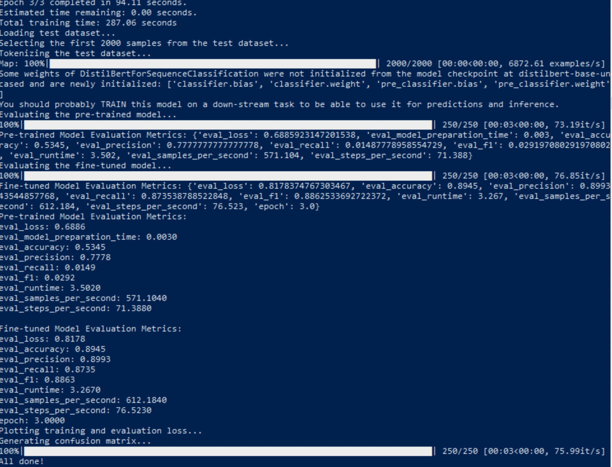

# LLaMA and DistilBERT Inference and Chatbot Application

This project uses Hugging Face's transformers library to perform various NLP tasks, including text generation with the Meta-LLaMA model and sequence classification using DistilBERT. It also includes a chatbot built with the Meta-LLaMA model and provisions for fine-tuning on custom datasets.

## Table of Contents
- [Directory Structure](#directory-structure)
- [Python Files](#python-files)
  - [gather_pythons.py](#gather_pythonspy)
  - [gpu_inference.py](#gpu_inferencepy)
  - [just_llama3.py](#just_llama3py)
  - [llama3_chatbot.py](#llama3_chatbotpy)
  - [llamatune.py](#llamatunepy)
- [Setup](#setup)
- [Usage](#usage)
  - [Running gpu_inference.py](#running-gpu_inferencepy)
  - [Running llama3_chatbot.py](#running-llama3_chatbotpy)
- [Logging and Outputs](#logging-and-outputs)
- [System and GPU Information](#system-and-gpu-information)
- [Training and Evaluation Metrics](#training-and-evaluation-metrics)
- [Screenshots](#screenshots)
- [Contact](#contact)

## Directory Structure
```
.
├── logs
├── results
│   ├── checkpoint-500
│   ├── checkpoint-750
└── python files
    ├── gather_pythons.py
    ├── gpu_inference.py
    ├── just_llama3.py
    ├── llama3_chatbot.py
    └── llamatune.py
```
- **logs**: Directory to store log files generated by the applications.
- **results**: Directory to store results like trained models, evaluation metrics, plots, and checkpoints.
- **results/checkpoint-500**, **results/checkpoint-750**: Subdirectories in `results` to store model checkpoints for various training steps.
- **python files**: Directory containing all the Python scripts.

## Python Files

### gather_pythons.py
This script gathers all Python files (`*.py`) in a specified root directory and its subdirectories, excluding certain directories defined in the `DIRECTORIES_TO_EXCLUDE` list. It writes the gathered data to an output file, which includes details about the number of Python files, directory structure, and the list of Python file paths.

**Functions**:
- `gather_python_files`: Recursively searches for `.py` files while excluding specified directories.
- `write_to_file`: Writes the gathered data to an output file, including directory and file paths.
- `main`: Entry point to run the script, gathers Python files, and writes the results to an output file.

### gpu_inference.py
This script performs sequence classification using a pre-trained DistilBERT model. It includes several steps for loading data, fine-tuning the model, evaluating performance, and logging results.

**Key Steps**:
- Set random seeds for reproducibility.
- Gather system and GPU information.
- Load the Yelp Polarity dataset and create a subset.
- Load a pre-trained `distilbert-base-uncased` model and tokenizer.
- Tokenize the dataset and define evaluation metrics.
- Configure training arguments and initialize the trainer.
- Train the model while logging metrics like loss, accuracy, precision, and recall.
- Evaluate both the pre-trained and fine-tuned models.
- Save plots for training and evaluation loss, and generate a confusion matrix.
- Write evaluation metrics and system information to a CSV file.

### just_llama3.py
This script loads a pre-trained Meta-LLaMA model to generate text based on a given prompt.

**Key Steps**:
- Load environment variables (Hugging Face token).
- Select the appropriate device (CUDA if available).
- Load the pre-trained Meta-LLaMA model and tokenizer.
- Create a text generation pipeline with adjusted parameters for more coherent results.
- Generate text based on a refined prompt and print the generated text.

### llama3_chatbot.py
This script implements a chatbot using the Meta-LLaMA model. It maintains a chat log, processes user inputs, and generates responses based on conversation history.

**Key Steps**:
- Initialize or reset the chat log.
- Load the pre-trained Meta-LLaMA model and tokenizer.
- Create a text generation pipeline.
- Truncate conversation context to fit the model's token limit.
- Enter an interactive loop to accept user inputs and generate bot responses.
- Append user-bot interactions to the chat log.

**Functions**:
- `initialize_chat_log`: Initializes or resets the chat log.
- `append_to_chat_log`: Appends user input and bot response to the chat log.
- `load_model_and_tokenizer`: Loads the model and tokenizer.
- `truncate_context`: Ensures the context fits within a token limit.
- `chatbot`: Main function to run the chatbot interactively.

### llamatune.py
This script fine-tunes the Meta-LLaMA model on a custom dataset created from IMDb movie data. It performs text generation using the fine-tuned model and evaluates its performance.

**Key Steps**:
- Load environment variables (Hugging Face token).
- Select the appropriate device (CUDA if available).
- Fetch IMDb data for specified movie titles.
- Preprocess the data using the tokenizer.
- Fine-tune the model on the tokenized dataset.
- Save the fine-tuned model and tokenizer.
- Test the fine-tuned model with a text generation pipeline and print the generated text.

**Functions**:
- `fetch_imdb_data`: Fetches IMDb data for specified movie titles.
- `preprocess_data`: Preprocesses the data using the tokenizer.
- `fine_tune_model`: Fine-tunes the model on the tokenized dataset.
- `main`: Main function to run the entire fine-tuning and testing process.

## Setup
1. Clone the repository.
2. Install the required dependencies:
   ```bash
   pip install -r requirements.txt
   ```
3. Set up the environment variables by creating a `.env` file with the following:
   ```
   HUGGINGFACE_TOKEN_LLAMA=your_huggingface_token
   ```

## Usage

### Running gpu_inference.py
This script performs sequence classification on the Yelp Polarity dataset. It loads the dataset, tokenizes it, fine-tunes the DistilBERT model, evaluates performance, and logs the results.
```bash
python gpu_inference.py
```

### Running llama3_chatbot.py
This script starts an interactive chatbot using the Meta-LLaMA model. It processes user inputs and generates appropriate responses based on conversation history.
```bash
python llama3_chatbot.py
```

## Logging and Outputs
- **Logs**: Training and evaluation metrics are logged every 50 steps.
- **Logs Directory**: Logs are stored in the logs directory.
- **Checkpoints**: Model checkpoints are saved in the results directory every 500 steps.
- **Plots**: Training and evaluation loss plots and confusion matrices are saved as PNG files in the current directory.
- **CSV Files**: Evaluation metrics and system information are saved to `training_comparison.csv`.

## System and GPU Information
The script gathers detailed system and GPU information, including:
- CPU count
- RAM size
- GPU load
- GPU memory usage
- GPU temperature

## Training and Evaluation Metrics
The following metrics are logged during training and evaluation:
- Accuracy
- Precision
- Recall
- F1 Score
- Training and Evaluation Loss

These metrics provide insights into the model's performance and training progress.

## Screenshots
Here are some screenshots showing the outputs and logs:

- **Training Infos**:
  

- **Evaluation Metrics**:
  

- **FineTune Interaction**:
  

- **Finetune Results**:
  

## Contact
For any inquiries or issues: https://www.linkedin.com/in/andytillo/